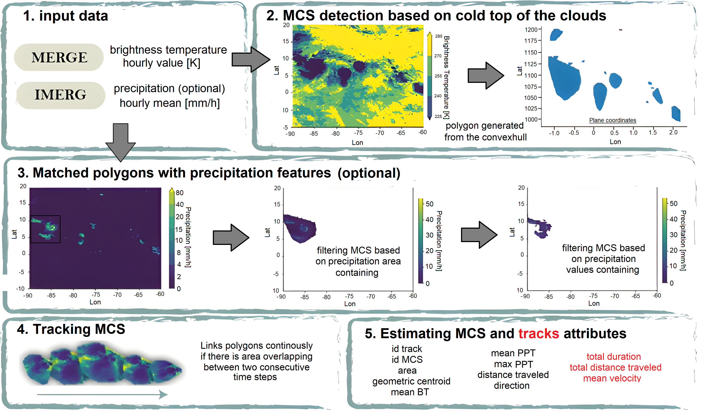

# Algorithm for Tracking Convective Systems (ATRACKCS)

## Introduction

ATRACKCS (Algorithm for Tracking Convective Systems) is a Python package for automated mesoscale convective systems (MCS) detection and tracking. The operation of the algorithm is by using brightness temperature and precipitation, whose data coming from satellite data (MERGE IR and IMERG V06B). 

The detection of the MCS is from the cold top of the clouds, based on magnitude threshold, and the generation of an approximate horizontal area from the convex hull. The tracking in time and space is done by overlapping areas. The algorithm allows parameterization and can be adapted to the specific needs of each geographic environment and/or MCS detection need.



ATRACKCS is intended for researchers and students who are interested in the characterization of MCS both in the meteorological (short term) and climatological (long term) fields.

## Main Dependencies

* Python3.7.
* netCDF4 (developed 1.5.6 in py3)
* numpy (tdeveloped 1.20.1 in py3)
* pandas (developed 1.3.5 in py3)
* scipy (developed 1.7.3 in py3)
* geopandas (developed in 0.9.0 in py3)
* xarray (developed in 0.18.0 in py3)
* gdal (developed in 3.1.4 in py3)
* geopy (developed in 2.2.0 in py3)
* shapely (developed in 1.8.0 in py3)
* rioxarray (developed in 0.9.1 in py3)
* rasterio (developed in 1.2.1 in py3)
* folium (optional, only used for plotting in 0.12.1.post1 in py3)
* OS: Linux or Windows, may work in MAC.

## Installation

Recommend building the Python environment using [Anaconda](https://www.anaconda.com/distribution/).

### Create conda environment using environment file

After Anaconda installation, git clone this repository:

```
git clone https://github.com/alramirezca/atrackcs
```

Then build a new conda environment using the environment file provided. For example:

```
cd ATRACKCS
conda env create -f env_py3.yml
```

This creates a new environment named `atrackcs_py3`. Activate the environment using

```
conda activate atrackcs_py3
```

After that, you can check the list of packages installed by

```
conda list
```

Finally install ATRACKCS using:

```
pip install -e .
```
## tests

To validate installation, issue a new Python session and run

```
import atrackcs
```

If nothing prints out, installation is successful.

## Inventory

* atrackcs: core module functions.
* notebooks: a series of jupyter notebooks illustrating the major functionalities of the package.
* scripts: example computation scripts. 

## Changelog

### v1.0

* initial upload. Can perform MSC detection and tracking through time and space.

## Contributing

We welcome contributions from the community. Please create a fork of the project on GitHub
and use a pull request to propose your changes. 

## use cases

* Spatio-temporal Characterization of Mesoscale Convective Systems over Northern South America. In AGU Fall Meeting 2021.
[AGU fall meeting 2021](https://agu.confex.com/agu/fm21/meetingapp.cgi/Paper/874852).

* Cloud-resolving Simulations of Mesoscale Convective Systems in Colombia. In AGU Fall Meeting 2021.
[ResearchGate](https://www.researchgate.net/publication/357975142_Cloud-resolving_Simulations_of_Mesoscale_Convective_Systems_in_Colombia).
[AGU fall meeting 2021](https://agu.confex.com/agu/fm21/meetingapp.cgi/Paper/875417).


## Getting help

Please post issues on the project GitHub page.
