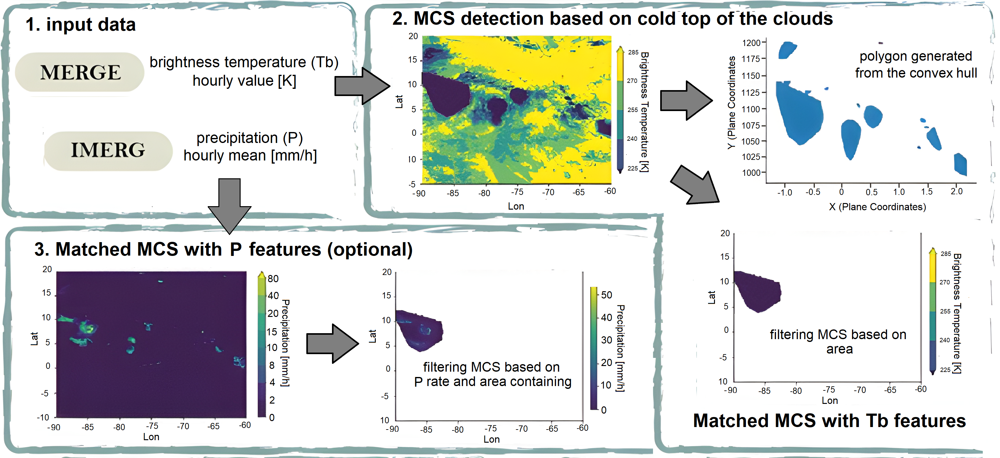
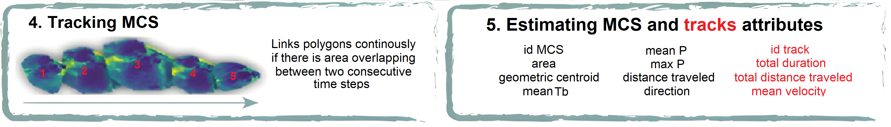

# Summary

Mesoscale convective systems (MCS) are organized cloud clusters that produce regional rainfall and feature vertical development penetrating the mid-upper troposphere. These events are frequent worldwide and are highly relevant as they can cause floods, thunderstorms, landslides, and river overflows [@Houze2018]. MCS also represent risks for both public and private activities, causing human losses, aviation delays, crop losses, and economic impacts. 
Therefore, the spatio-temporal characterization of MCS contributed to reducing the vulnerability to severe precipitation events, as well as understanding weather and regional climate [@Weipert2008]. 

Thermal emission maps of the Earth surfaces can be obtained from satellite infrared data. At a given surface temperature electromagnetic radiation is emitted and depends on the emission temperature; this temperature is known as the brightness temperature (Tb). Although the magnitude of Tb does not represent a direct measurement of precipitation, it is an indirect representation of cloud cover height associated with an MCS event. Some methodologies for MCS detection use other satellite spectral bands as a proxy for precipitation (P) [@Feng2021; @Liu2019]

ATRACKCS is a Python package for the automated detection and tracking of MCS. It is a potential tool for characterizing their spatio-temporal distribution and evolution. ATRACKCS provides a set of Python functions designed for a workflow analysis  that includes the detection and characterization of  MCS, as well as the integration in tracks, allowing detailed monitoring of the MCS life cycle both in space and time.

# Statement of need

Currently, there are geographic information systems and algorithms available on the internet that focus on the detection and tracking of MCS, however, they are usually closed-source and have fixed parameters for their operation.  Recent literature about MCS detection suggests a wide variety of maximum value limits to the Tb depending on the study region, event’s area, applied methodology and satellite databases, among other aspects. It represents a challenge when selecting the conditions for MCS detection, and was the motivation for developing  ATRACKCS, which allows the Tb parameterization according to the interest of the user.
ATRACKCS is an open-source algorithm that uses public data and can be adapted to the needs of MCS detection based on specific Tb and P parameters. 

The algorithm's output is a structured CSV file containing the tracks of each detected MCS, whose influence’s regions and attributes can be observed through the map hosted in a HTML file. The HTML file allows nowcasting and spatio-temporal characterization of MCS. This package is intended for researchers and students interested in exploring MCS dynamics.

# Technical details and Usage 

The MCS (regions) detection and characterization are performed using these steps: The following steps refer to Figure 1.

1. The input data: Tb [@T2017] and P [@P2019] area processed. The algorithm can operate with Tb as the only input variable.
2. At a given time step, the algorithm finds all pixels where Tb <= Tb_threshold $[200 k, 240 k]$ and defines approximate regions with the convex hull, using a binary structure where the pixels that satisfy the described condition are equal to 1 and the remaining pixels are equal to 0. Transform from geographic to plane coordinates and compute an approximate area of the defined region, discard all regions where area is `<= area_threshold $[> 1000 km^2]$ and estimate Tb attributes of those regions.
3. Estimate P attributes of those regions and discard regions based on P rate and P area containing. This is optional.

The tracks are performed using these steps: The following steps refer to Figure 2.

4. Overlapping priority principle: for any MCS at time t, the MCS with the highest overlap percentage at time t+1 "wins" and is associated with it. If there are MCS with lower overlap percentages, they are left to be associated in the next iteration and form a track on their own. No merging or splitting is allowed, any MCS at time t can only be linked to one MCS at time t+1. Similarly, any MCS at time t+1 can only be linked to one MCS at time t. All tracks that do not get updated during the t - t+1 process terminate. 
5. Estimate MCS and tracks attributes.

The algorithm can be adapted to the needs of the MCS detection, as the user is allowed to define the thresholds of Tb and P (no required).

# Example use case

Different applications can be made with ATRACKS. This example tracks a single MCS, but the analyses can be extended both spatially and temporally depending on the interest.

Notebooks and scripts presenting the algorithm functionalities based on use cases are available on the [repository page](https://github.com/alramirezca/ATRACKCS). 

# Runtime and efficiency

Accurately measuring the runtime and efficiency of ATRACKCS is not a trivial task, since the results may vary significantly due to factors associated with the hardware, software, input region and algorithm parameterization. With the intention of giving a base time estimate, the algorithm was executed for the northern region of South America, composed of 300 pixels (latitude) by 300 pixels (longitude), for the dates between 2019-12-24 19:00 and 2019-12-31 18:00 (168 hours), with a computer equipped with Windows 10 operating system, with an Intel Core i5-8250U processor - 1. 80 GHz and 12 GB RAM; for more details of the algorithm parameterization, please refer the example hosted in the repository page [1_detect_and_track_MCS_scheme_Tb_and_P](https://github.com/alramirezca/ATRACKCS/blob/main/notebooks/1_detect_and_track_MCS_scheme_Tb_and_P.ipynb). This submitted example took 14.5 minutes to be executed and identified 3200 MCS organized in 1207 tracks.

# Past or ongoing research projects using the software

Previous ATRACKCS version were presented in the oral presentation and poster in  American Geophysical Union (AGU) Fall Meeting in December 2021:

1. Spatio-temporal Characterization of Mesoscale Convective Systems over Northern South America. In AGU Fall Meeting 2021 [@Rendon2021a].
2. Cloud-resolving Simulations of Mesoscale Convective Systems in Colombia. In AGU Fall Meeting 2021 [@Rendon2021b].

# Acknowledgements

This research was funded by the Colombian Ministry of Science, Technology and Innovation (MINCIENCIAS) through the project: “Implementación de un sistema de investigación y pronóstico meteorológico de corto plazo con el modelo WRF, para apoyo a sistemas de comando y control de la Fuerza Aérea Colombiana” (code 1115-852-70955) with funds from “Patrimonio Autónomo Fondo Nacional de Financiamiento para la Ciencia, la Tecnología y la Innovación, Fondo Francisco José de Caldas”. IMERG V06B (P) and Merge IR V1 (Tb) data was obtained from NASA GES DISC server.

# References
